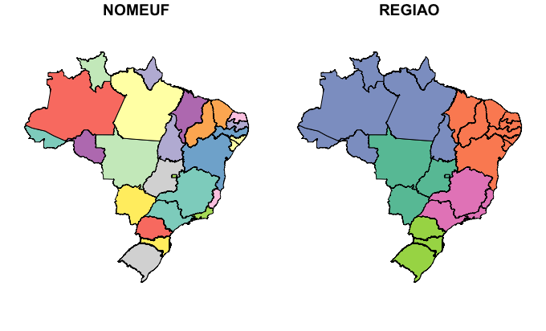
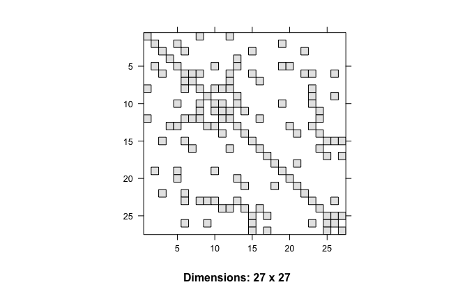
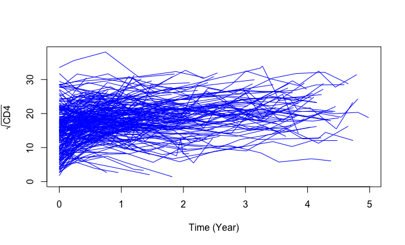
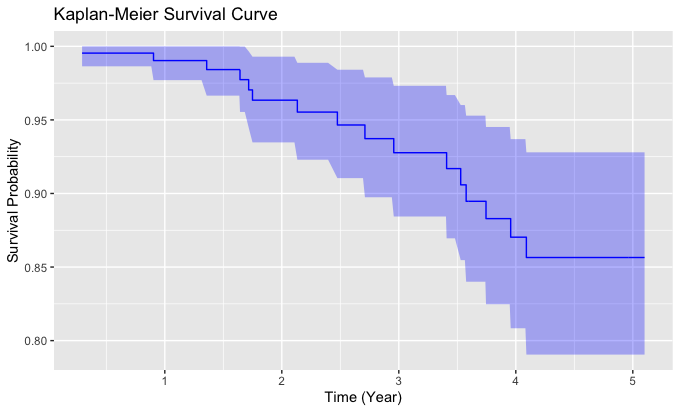

# Approximate Bayesian for spatial joint modeling
On this page, you can access the R code accompanying our paper titled "Approximate Bayesian Inference for Joint Partially Linear Modeling of Longitudinal Measurements and Spatial Time-to-Event Data" authored by Baghfalaki, Ganjali, and Martins. The paper introduces an innovative approximate Bayesian hierarchical model designed for jointly modeling longitudinal and spatial survival outcomes. To achieve this, we utilize a conditional autoregressive model to account for spatial effects, while also incorporating a joint partially linear model to capture the nonlinear impact of time on the longitudinal response. We evaluate the method's performance through comprehensive simulation studies and further apply it to analyze real-world HIV/AIDS data collected from various Brazilian states.

##### Brazil Map and adjacency matrix

##### Individual trajectories of the square root of CD4 levels over time for the selected sample of the HIV/AIDS longitudinal data.

##### Kaplan-Meier survival curve for mortality over five years of follow-up for the selected sample of the HIV/AIDS data.

### Reference 
Baghfalaki, T. Ganjali, M. & Martins, R. (2024). Approximate Bayesian inference for joint partially linear modeling of longitudinal measurements and spatial time-to-event data. *Revised*.
